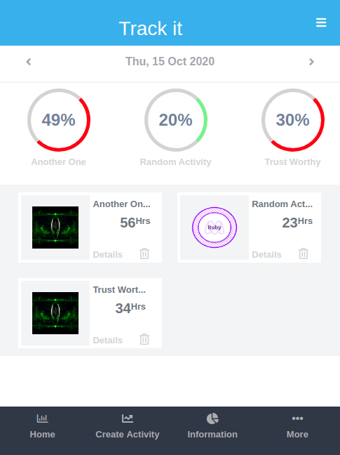
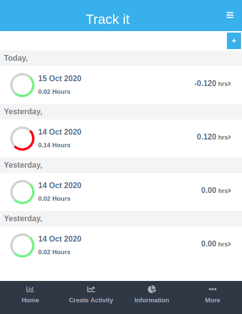
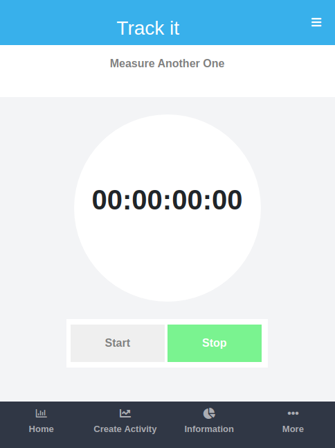

## Track It API (Tracking Application).[Solo Project]

### Articles Blog Description
Using this application, User can create various activities and monitor his or her progress. For example if a user wants to measure how much time performing a certain taks e.g Programming, he or she can time himeself daily to see if he spent less time or more time performing certain task. For this scope, the users are expected to create various activities and monitor their daily progress while performing these activities. The application is built for all screen types i.e Desktop, mobile and tabs.. This [ERD](https://app.lucidchart.com/lucidchart/8fac66af-9610-4e5c-ba66-508ce97db326/edit?beaconFlowId=398015E0B809B573&page=0_0#?folder_id=home&browser=icon) diagram demonstrates the association among the various models used in the application

## Built With
This project development was achieved using the following technologies:

- Ruby on Rails,
- Bootstrap and CSS
- Rspec
- Capybara

## Live Demo

- [Live Link](https://trackingappk.herokuapp.com/)

## Video Description 

- [Description Link](https://www.loom.com/share/adf35c8e794d4a17b97ab95a35a834c0)

## Home Page of the Application

## Activity Measurements Page

## Create Measurements Page

## Getting Started

To get a local copy up and running follow these simple example steps.

### Prerequisites

#### You should have installed git on your local machine and a text editor of your choice.
### Setup

- Forking the project-Repository
- Cloning the project to your local machine
- `cd` into the project directory
- Run `bundle install` to install the Gemfiles
- Run `db:migrate` to install the Gemfiles
- Run `rails db:seed`to add Sample Category data to database
- From the root directory, run `rails server` to start the Project on `localhost:3000`

## Usage section

- Sign Up in the application and create Activities
- Each Activity is monitored seperately, therefore you can go ahead and create measurement for each activity
- Your daily progress for each activity will be displayed

## Checking the tests with RSpec
The tests for the model and controllers was implemented using RSpec gem. To execute these test cases, run `bundle exec rspec ` to display the test cases of the application. 

## Author

👤 **Odong Sunday**

- [Portfolio](https://odongsunday.netlify.app/)
- Github: [@OdongAlican](https://github.com/OdongAlican)
- Twitter: [@odongsandie](https://twitter.com/odongsandie)
- Linkedin: [Sunday Alican odong](https://www.linkedin.com/in/sunday-alican-odong/)
- [Email](mailto:sandieo.2020@gmail.com)

## 🤝 Contributing

Contributions, issues and feature requests are welcome! Start by:

- Forking the project
- Cloning the project to your local machine
- `cd` into the project directory
- Run `git checkout -b your-branch-name`
- Make your contributions
- Push your branch up to your forked repository
- Open a Pull Request with a detailed description to the development branch of the original project for a review

## Credits

Thanks to [Gregoire Vella and others on Behance](https://www.behance.net/gregoirevella) for his awesome design work. I based my work on  [this](https://www.behance.net/gallery/13271423/Bodytrackit-An-iOs-app-Branding-UX-and-UI) design.

## Show your support

Give a ⭐️ if you like this project!

Feel free to check the [issues page](issues/).

## Show your support

Give a ⭐️ if you like this project!

## Acknowledgments

- Appreciation to my coding Partner and mentor

## 📝 License

This project is [MIT](lic.url) licensed.
